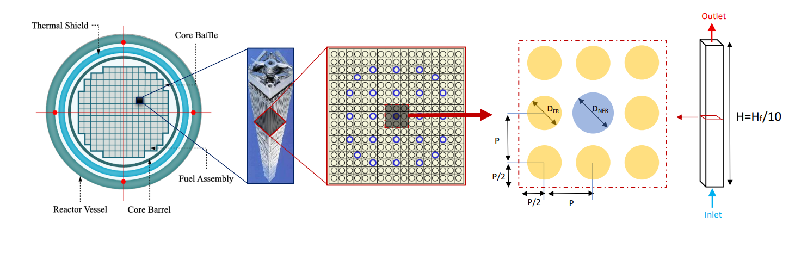
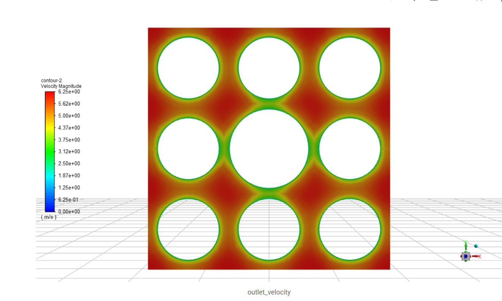
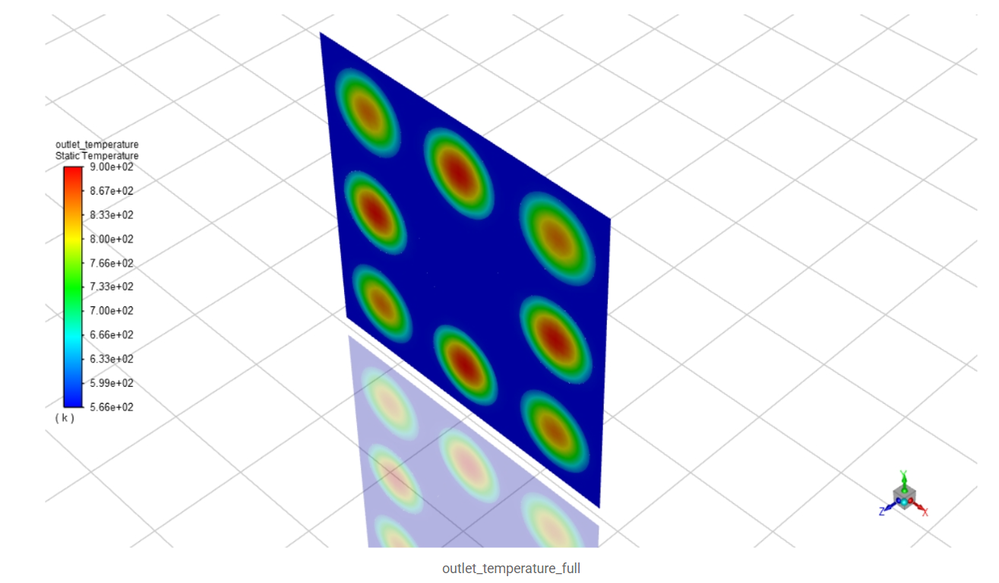

# CFD Simulation of a 3×3 PWR Rod Bundle

A full **conjugate heat transfer (CHT)** CFD simulation of a 3×3 Pressurized Water
Reactor (PWR) fuel-rod bundle, performed in **ANSYS Fluent** and **Star-CCM+** and
cross-validated against analytical correlations.

> NEM 358 — Nuclear Thermal Hydraulics (Term Project) · Hacettepe University, Department of Nuclear Engineering.

---

## Problem Description

Fuel bundles are the most critical thermal-hydraulic components of a reactor core.
This project resolves the 3D flow and heat-transfer behavior inside the subchannels
of a 3×3 fuel-rod array (with a central non-fuel guide tube), using parameters from
a typical 4-loop PWR.

**Geometry & Operating Conditions**

| Parameter | Value |
| :--- | :--- |
| Bundle | 8 fuel rods + 1 central guide tube (3×3) |
| Fuel rod diameter | 9.5 mm |
| Guide tube diameter (D_NFR) | 12.243 mm |
| Domain cross-section | 37.8 mm × 37.8 mm |
| Active height, H | 0.366 m (H_f / 10) |
| Inlet temperature, T_in | 292.7 °C (565.85 K) |
| Operating pressure | 15.51 MPa |

---

## Results Gallery

**Multi-scale modeling domain** — from the full PWR core down to the 3×3 subchannel:

<p align="center"></p>

<table>
<tr>
<td width="50%"><br><sub><b>Velocity magnitude</b> (Star-CCM+, full 3×3 geometry).</sub></td>
<td width="50%"><br><sub><b>Outlet temperature field</b> — reflects the non-uniform radial power profile.</sub></td>
</tr>
</table>

---

## Methodology

### Approach
- **ANSYS Fluent:** 1/4-symmetry model (exploiting quadrature symmetry of the power distribution) → 1 subchannel.
- **Star-CCM+:** full 3×3 geometry built via Boolean subtraction (coolant vs. solid regions), solved with full **conjugate heat transfer**.

### Power Distribution
A non-uniform radial power fraction matrix was imposed via volumetric heat sources:

```
[0.85  1.00  0.85]
[1.00   0    1.00]      → q'''(1.00) = 2.5136 × 10⁸ W/m³
[0.85  1.00  0.85]        q'''(0.85) = 2.1366 × 10⁸ W/m³
                          q'''(guide) = 0
```

### Models & Correlations
- Steady-state, 3D, turbulent, segregated flow + segregated fluid/solid energy
- **k-ω SST** turbulence model (wall-bounded flows & near-wall heat transfer)
- Gravity included for the hydrostatic pressure contribution
- Validated against analytical correlations: **Petukhov** friction factor,
  **Dittus–Boelter** Nusselt number, Darcy–Weisbach pressure drop

### Coolant Properties (pressurized water @ 15.51 MPa)
`ρ = 706.2 kg/m³`, `μ = 8.71 × 10⁻⁵ Pa·s`, `c_p = 5950 J/kgK`, `k = 0.54 W/mK`.

---

## Key Results

* Simultaneously resolved the **3D velocity, temperature, and pressure fields**
  within all subchannels of the bundle.
* Cross-validated **ANSYS Fluent** (1/4 symmetry) and **Star-CCM+** (full geometry)
  against each other and against analytical correlations.
* Quantified the effect of the non-uniform radial power profile on local coolant
  heating and subchannel temperature distribution.

---

## Contents

- `pwr-rod-bundle-cfd.pdf` — full project report (methodology, ANSYS Fluent & Star-CCM+ results, analytical benchmark, comparison).

## Authors

**Emre Sakarya** (Student ID: 2230386062) — ANSYS Fluent\
**Eren Gürel** (Student ID: 2220386044) — Star-CCM+

Nuclear Engineering, Hacettepe University.
